# Enterprise AI Document Intelligence & Synthesis Platform — Product Requirements Document (PRD)

**Version:** 2.0.0  
**Author:** Senior UI/UX Designer & Staff AI Systems Engineer  
**Status:** Approved & Production-Ready  
**Target Platform:** Next.js 15 App Router · TypeScript · Prisma/SQLite · Tailwind CSS · Google Gemini 3.6 Flash  

---

## 1. Executive Summary & Product Vision

### 1.1 Vision
The **Enterprise AI Document Intelligence & Synthesis Platform** bridges the gap between raw, unstructured enterprise files and polished, publication-ready executive deliverables. What started as a simple document format converter (`Convertdoc`) is elevated into an intelligent, dual-role AI document studio (`Studio`) that ingests diverse enterprise artifacts (PDF, Word, Markdown, Plaintext, JSON, Images), extracts strictly validated structured semantic models, computes real-time token/cost telemetry, compiles bespoke executive PDF briefs, and enables plain-language follow-up distillation.

### 1.2 Core Value Proposition
- **High-Fidelity Structured Extraction:** Converts noisy meeting notes, invoices, SLAs, and technical specifications into validated Zod JSON entities (executive summaries, nested sections, tabular grids, action items with assignees/deadlines, financial line items, reading grade levels).
- **Dual-Role AI Architecture:**
  - **Role 1 (The Structured Analyst):** Deterministic extraction ($T=0.2$) enforcing comprehensive JSON schema compliance with active validation retry loops.
  - **Role 2 (The Communicator):** Humanized plain-language summarization ($T=0.4$) calculating readability grade levels and word reduction percentages.
- **Enterprise-Grade Reliability & Truthfulness:** Zero silent simulation fallbacks. Every timeout, rate limit, provider error, or schema validation failure is captured verbatim with structured error taxonomies and surfaced to the UI.
- **Cost & Resource Transparency:** Live token attribution and per-run pricing models (`$0.75/1M` input, `$3.75/1M` output) guarded by a `$2.00` hard monthly budget cap, bounded FIFO queue concurrency ($N=2$), and DB-backed fixed-window rate limiting (15 uploads / 60s, 10 follow-ups / 60s).
- **Design Token-Driven Aesthetics:** Fully harmonized Material-3 design system with dark mode (`#090d16`), glassmorphism, luminous state indicators, and WCAG 2.1 AA compliant contrast.

```mermaid
graph LR
    A[Client Uploads 1-8 Files] --> B[Server Upload Policy & Size Validation]
    B --> C[Local Object Storage / Key Generation]
    C --> D[Prisma DB Job Record Created]
    D --> E[Bounded FIFO Queue Concurrency: 2]
    E --> F[Pipeline: QUEUED → PREPROCESSING]
    F --> G[Role 1: Structured Analyst Inference]
    G --> H{Zod Schema Valid?}
    H -- No (Retry < 3) --> G
    H -- No (Exhausted) --> I[Truthful FAILED State + Diagnostic Error]
    H -- Yes --> J[Pipeline: FORMATTING → COMPILING_PDF]
    J --> K[Executive PDF Base64 + Token/Cost Record]
    K --> L[COMPLETED Studio Result View]
    L --> M[Role 2: Plain-Language Follow-Up Communicator]
    M --> N[FollowUp Row + Reduction Metrics]
```



---

## 2. Target User Personas & Core Workflows

### 2.1 Personas

| Persona | Role & Context | Core JTBD (Jobs-To-Be-Done) | Critical Pain Points Solved |
| :--- | :--- | :--- | :--- |
| **Elena Rostova** | *VP of Operations / Chief of Staff* | Needs to ingest 10-page unformatted executive notes and receive a structured executive summary, identified action items, and an immediate downloadable PDF brief. | Eliminates manual document reformatting; surfaces assignees and deadlines in seconds. |
| **Marcus Vance** | *Legal & Compliance Lead* | Ingests enterprise master service agreements (MSAs) and vendor contracts to audit SLAs, termination clauses, and financial commitments. | Strict Zod validation guarantees no hallucinated terms; raw AI responses & model traces provide complete auditability. |
| **David Chen** | *Lead Cloud Architect* | Monitors batch ingestion jobs across departments, verifying API rate limits, queue latency, and cost attribution per department. | Live SSE logs, transparent token cost accounting down to four decimals ($0.0038), and bounded FIFO queue telemetry. |

### 2.2 Primary User Journeys

#### Journey 1: Multi-Document Ingestion & Executive Synthesis
1. User lands on `/studio`.
2. Drags and drops 3 files (e.g., meeting notes, invoice, contract proposal) or picks from the built-in sample presets.
3. Selects Document Type (`report`, `invoice`, `contract`, `notes`, `spec`, `generic`), Provider (`gemini`), and Visual Template Style (`executive`, `corporate`, `minimal`, `modern`).
4. Clicks **"Process Documents"**.
5. The UI shows optimistic upload feedback, rejects any oversized/invalid files with per-file diagnostic reasons, and adds jobs to the live processing table.
6. The Bounded FIFO Queue visually indicates active processing (`Active: 2/2 · Queued: 1`).
7. User selects a completed job to view the live tabbed inspector:
   - **Executive PDF Preview:** High-res responsive PDF embedded with full zoom/download controls.
   - **Structured Data Tree:** Collapsible hierarchy showing Executive Summary, Categorized Sections, Tabular Grids, Action Item badges, and Financial breakdowns.
   - **Telemetry & Cost Badge:** Prompt tokens, completion tokens, execution time (ms), and exact spend.
   - **Historical Logs (SSE):** Stage-by-stage timestamped pipeline audit trail.

#### Journey 2: Plain-Language Follow-Up Distillation
1. From a completed job, user navigates to the **"Plain-Language Summary"** action pane.
2. Clicks **"Generate Plain-Language Summary"**.
3. A secondary background task is enqueued to `/api/jobs/[id]/followup` utilizing Role 2 Communicator prompt.
4. Returns a punchy headline, 2-3 sentence executive distillation, 4 bulleted key points, readability score (e.g., "9th Grade Readability"), and word reduction percentage (e.g., "78.4% reduction").

#### Journey 3: Failure Transparency & Self-Healing Verification
1. User toggles **"Simulate Schema Validation Miss"** in the Studio configuration panel.
2. Uploads a sample document.
3. The pipeline runs, catches the schema violation, executes the backoff retry loop up to 3 attempts feeding error feedback back to the model, and upon final failure truthfully flags the job as `FAILED`.
4. The UI highlights the exact schema error in a rose-tinted diagnostic callout (`VALIDATION: title: Required; sections: Array must contain at least 1 element(s)`), proving zero silent fallbacks.

---

## 3. UI/UX Design System & Architectural Standards

### 3.1 Design Philosophy: Modern Dark-First Studio & Tonal Tokens
The application follows a dual-theme strategy:
1. **Public Converter (`/`):** Clean, inviting, light-mode layout leveraging Material 3 tonal surface tokens (`nuetral99`, `nuetral100`).
2. **AI Studio (`/studio`):** Immersive, high-performance dark theme (`#090d16` background, `#0f172a` surface, `#1e293b` elevated cards) with glassmorphic borders, luminous accent indicators, and glowing hero gradients.

### 3.2 Design Token Architecture
Tokens originate in `design-tokens.tokens.json` (Figma Tokens / Tokens Studio format) and are converted via `convert-tokens.js` to `design-tokens.css`:
- **Primitives:** Foundation palettes (Neutral, Primary, Secondary, Tertiary, Error tones 0–100).
- **Color Roles:** Semantic variables (`--colors-roles-primary`, `--colors-roles-on-primary`, `--colors-roles-primary-container`, `--colors-roles-error-container`).
- **Surface Elevation Scale:**
  - Base canvas: `var(--primitives-colors-neutral-color-palete-nuetral99)` / `#090d16`
  - Container / Surface: `var(--primitives-colors-neutral-color-palete-nuetral100)` / `#0f172a`
  - Elevated Card: `#1e293b` with `box-shadow: var(--effect-soft-shadow)`
  - Highlight / Border: `#334155` with 1px border stroke (`rgba(255, 255, 255, 0.08)`)

### 3.3 Status Indication & Semantic Accents
Every pipeline stage has a dedicated, high-contrast semantic badge:

| Pipeline Stage | Semantic Color | Tailwind Token Badge | State Meaning |
| :--- | :--- | :--- | :--- |
| `QUEUED` | Slate / Neutral | `bg-slate-500/15 text-slate-300 border-slate-500/30` | Waiting in bounded FIFO queue |
| `PREPROCESSING` | Sky Blue | `bg-sky-500/15 text-sky-300 border-sky-500/30 animate-pulse` | Validating text extraction / storage |
| `INFERENCE` | Amber / Gold | `bg-amber-500/15 text-amber-300 border-amber-500/30 animate-pulse` | Dual-role LLM generation active |
| `FORMATTING` | Violet | `bg-violet-500/15 text-violet-300 border-violet-500/30` | Parsing & Zod schema validation |
| `COMPILING_PDF` | Indigo | `bg-indigo-500/15 text-indigo-300 border-indigo-500/30` | Client/server jsPDF compilation |
| `COMPLETED` | Emerald Green | `bg-emerald-500/15 text-emerald-300 border-emerald-500/30` | Structured data + PDF ready |
| `FAILED` | Rose Red | `bg-rose-500/15 text-rose-300 border-rose-500/30` | Truthfully failed with machine code |

### 3.4 Micro-Interactions & Animation Specs
- **Pulsing Status Indicators:** Staged jobs in active progress (`PREPROCESSING`, `INFERENCE`) feature a subtle 3s cubic-bezier pulse.
- **Queue Progress Bar:** Smooth width transition (`transition-all duration-500 ease-out`).
- **Telemetry Counter:** Tabular figures (`font-mono` / `tabular-nums`) to prevent layout shifts during live SSE metric updates.
- **Drilldown Pane Slide-in:** Smooth opacity and transform fade (`duration-200 ease-out`).

### 3.5 Accessibility (WCAG 2.1 AA) Compliance
- Contrast ratio $\ge 4.5:1$ for all body copy and $\ge 3:1$ for interactive buttons/badges.
- Visible focus rings (`focus-visible:ring-2 focus-visible:ring-primary-400 focus-visible:ring-offset-2`).
- Semantic HTML tags (`<main>`, `<header>`, `<nav>`, `<section>`, `<table>`, `<article>`).
- ARIA live regions (`aria-live="polite"`) for background queue updates and SSE streaming logs.

---

## 4. Functional Specifications & System Architecture

### 4.1 Module Breakdown

```
┌────────────────────────────────────────────────────────────────────────┐
│                        NEXT.JS 15 APP ROUTER                           │
├────────────────────────────┬───────────────────────────────────────────┤
│ Frontend Studio UI         │ Backend API & Background Queue            │
│ ├─ Multi-File Dropzone     │ ├─ POST /api/jobs (Validation & Enqueue) │
│ ├─ Preset Picker Cards     │ ├─ GET  /api/jobs (List & Queue Meta)    │
│ ├─ Live Pipeline Table     │ ├─ GET  /api/jobs/[id] (Detail & Schema) │
│ ├─ Structured Inspector    │ ├─ POST /api/jobs/[id]/followup (Role 2) │
│ └─ PDF Preview Modal       │ └─ GET  /api/jobs/[id]/stream (SSE)      │
├────────────────────────────┴───────────────────────────────────────────┤
│                        SHARED CORE SERVICES                            │
│ ├─ Central Config (src/lib/config.ts)                                 │
│ ├─ Zod Schema Engine (src/lib/schemas.ts)                             │
│ ├─ Dual-Role AI Orchestrator (src/lib/ai/orchestrator.ts)             │
│ ├─ Bounded FIFO Worker Queue (src/lib/queue/worker.ts)                │
│ ├─ DB-Backed Rate Limiter (src/lib/rate-limit.ts)                     │
│ ├─ Local Object Storage (src/lib/storage.ts)                          │
│ └─ PDF Engine (src/lib/pdf/generator.ts)                              │
└────────────────────────────────────────────────────────────────────────┘
```

### 4.2 Configuration Parameters (`src/lib/config.ts`)

| Area | Key | Value | Engineering Rationale |
| :--- | :--- | :--- | :--- |
| **Model** | `provider.gemini.analysisModel` | `gemini-3.6-flash` | Live-verified via `ListModels`; native structured JSON capabilities. |
| **Model** | `provider.gemini.followUpModel` | `gemini-3.6-flash` | Cost-effective, high-speed summarizer. |
| **Temperature** | `generation.analysisTemperature` | `0.2` | Near-deterministic; restructures facts without hallucination. |
| **Temperature** | `generation.followUpTemperature` | `0.4` | Fluent prose while staying well beneath hallucination thresholds ($0.7+$). |
| **Tokens** | `generation.analysisMaxOutputTokens` | `4096` | Accommodates rich multi-section documents and large tabular rows. |
| **Tokens** | `generation.followUpMaxOutputTokens` | `1024` | Caps summary cost and guarantees fast turnaround. |
| **Timeout** | `generation.contextTimeoutMs` | `30,000 ms` | Enforced via `AbortController`; aborts unresponsive calls truthfully. |
| **Retries** | `retry.maxAttempts` | `3` | Base 1s backoff doubled per attempt (1s, 2s) with schema error feedback. |
| **Queue** | `queue.concurrency` | `2` | Bounded outbound concurrency protects rate limits and provider quotas. |
| **Rate Limit** | `rateLimit.upload` | `15 / 60s` | DB-backed fixed window keyed by IP. |
| **Rate Limit** | `rateLimit.followUp` | `10 / 60s` | Independent rate-limit window for secondary summarizations. |
| **File Limit** | `file.maxSizeBytes` | `10 MB` | Bounds memory consumption and token context windows. |
| **File Limit** | `rateLimit.maxFilesPerRequest` | `8` | Maximum batch upload size. |
| **Pricing** | `cost.geminiInputUsdPerM` | `$0.75` | Published Google Gemini API tier. |
| **Pricing** | `cost.geminiOutputUsdPerM` | `$3.75` | Published Google Gemini API tier. |
| **Guardrail** | `cost.monthlyBudgetCapUsd` | `$2.00` | Hard stop preventing accidental runaway cost loops. |

---

## 5. API Contracts & Data Specifications

### 5.1 REST Endpoints

#### 1. `POST /api/jobs`
- **Purpose:** Ingests batch files, validates mime/size, persists files to object storage, creates DB records, and enqueues background processing.
- **Request:** `multipart/form-data`
  - `files[]`: File list (1 to 8 files, max 10MB each)
  - `documentType`: `report` | `invoice` | `contract` | `notes` | `spec` | `generic`
  - `modelProvider`: `gemini` | `openai` | `simulation`
  - `modelName`: `gemini-3.6-flash` | `gpt-4o-mini`
  - `templateStyle`: `executive` | `corporate` | `minimal` | `modern`
  - `simulateInvalidOutput`: `boolean` (optional failure injection demo)
- **Response `201 Created`:**
  ```json
  {
    "success": true,
    "count": 2,
    "jobs": [
      {
        "id": "cuid_xyz123",
        "fileName": "q4_roadmap.txt",
        "status": "QUEUED",
        "progress": 0,
        "currentStage": "Queued",
        "attempts": 0,
        "storageKey": "uuid-dir/q4_roadmap.txt",
        "createdAt": "2026-09-18T15:00:00.000Z"
      }
    ]
  }
  ```
- **Error Responses:** `400 Bad Request` (with per-file validation reasons), `429 Too Many Requests` (with `Retry-After`).

#### 2. `GET /api/jobs`
- **Purpose:** Fetches recent jobs with live queue concurrency metadata.
- **Response `200 OK`:**
  ```json
  {
    "jobs": [ /* Array of JobRow */ ],
    "queue": {
      "active": 2,
      "capacity": 2,
      "queued": 1
    }
  }
  ```

#### 3. `GET /api/jobs/[id]`
- **Purpose:** Returns complete job detail, historical logs, structured data JSON, token/cost telemetry, and executive PDF base64 data URI.

#### 4. `POST /api/jobs/[id]/followup`
- **Purpose:** Triggers Role 2 plain-language summarization from completed structured job data.
- **Request:** `{ "action": "summarise" }`
- **Response `201 Created`:**
  ```json
  {
    "success": true,
    "followUp": {
      "id": "fup_abc789",
      "jobId": "cuid_xyz123",
      "action": "summarise",
      "status": "PENDING"
    }
  }
  ```

---

## 6. Engineering & Database Schema (`prisma/schema.prisma`)

```prisma
model Job {
  id               String      @id @default(cuid())
  documentType     String      @default("generic")
  fileName         String
  fileSize         Int
  mimeType         String
  storageKey       String?     // Key in storage/uploads/<uuid>/<name>; never raw bytes
  attempts         Int         @default(0)
  filePath         String?
  filePreviewUrl   String?
  sourceText       String?
  status           String      @default("QUEUED") // QUEUED|PREPROCESSING|INFERENCE|FORMATTING|COMPILING_PDF|COMPLETED|FAILED
  progress         Int         @default(0)
  currentStage     String      @default("Queued")
  modelProvider    String      @default("gemini")
  modelName        String      @default("gemini-3.6-flash")
  templateStyle    String      @default("executive")
  
  // AI Output Payload (Role 1 Structured Output)
  title            String?
  subtitle         String?
  summary          String?
  author           String?
  date             String?
  structuredData   String?     // Validated JSON string adhering to StructuredDocumentSchema
  rawAiResponse    String?
  confidenceScore  Float?      @default(0.95)
  
  // Output Assets & Telemetry
  pdfDataUri       String?     // Pre-rendered base64 data URI
  promptTokens     Int?        @default(0)
  completionTokens Int?        @default(0)
  totalTokens      Int?        @default(0)
  estimatedCost    Float?      @default(0.0)
  processingTimeMs Int?        @default(0)
  errorMessage     String?
  verifiedByUser   Boolean     @default(false)
  
  createdAt        DateTime    @default(now())
  updatedAt        DateTime    @updatedAt
  logs             JobLog[]
  followUps        FollowUp[]

  @@index([status])
  @@index([documentType])
  @@index([createdAt])
}

model JobLog {
  id        String   @id @default(cuid())
  jobId     String
  job       Job      @relation(fields: [jobId], references: [id], onDelete: Cascade)
  stage     String
  message   String
  level     String   @default("info") // info | warn | error | success
  timestamp DateTime @default(now())

  @@index([jobId])
}

model FollowUp {
  id               String   @id @default(cuid())
  jobId            String
  job              Job      @relation(fields: [jobId], references: [id], onDelete: Cascade)
  action           String   @default("summarise")
  status           String   @default("PENDING") // PENDING | PROCESSING | DONE | FAILED
  attempts         Int      @default(0)
  errorMessage     String?
  output           String?  // Validated JSON adhering to FollowUpOutputSchema
  rawAiResponse    String?
  modelProvider    String   @default("gemini")
  modelName        String   @default("gemini-3.6-flash")
  promptTokens     Int?     @default(0)
  completionTokens Int?     @default(0)
  totalTokens      Int?     @default(0)
  estimatedCost    Float?   @default(0.0)
  processingTimeMs Int?     @default(0)
  createdAt        DateTime @default(now())
  updatedAt        DateTime @updatedAt

  @@index([jobId])
  @@index([status])
}

model RateLimitEntry {
  id     String  @id @default(cuid())
  kind   String  // upload | follow-up
  key    String  // client IP
  bucket Int     // Math.floor(Date.now() / windowMs)
  count  Int     @default(0)

  @@unique([kind, key, bucket])
  @@index([kind, bucket])
}
```

---

## 7. Reliability, Safety & Failure Architecture

### 7.1 Truthful Failure Guarantee
1. **No Silent Fallbacks:** If Gemini API fails, times out (30s), or is rate limited, the error is recorded verbatim with its `AIFailureError` code (`TIMEOUT`, `PROVIDER`, `RATE_LIMITED`, `VALIDATION`, `BAD_REQUEST`). The system never pretends a live call succeeded by quietly swapping in fake mock data.
2. **Deterministic Simulation:** Simulation mode is strictly an explicit user choice (`modelProvider: "simulation"`).
3. **Validation Feedback Loop:** When Zod schema validation fails, the orchestrator re-invokes the model with specific schema feedback up to `maxAttempts = 3`:
   ```
   "Previous output failed validation: [title: Required]. Return strictly valid JSON."
   ```

### 7.2 Storage Security & Path Traversal Guards
- All uploads are stored under `storage/uploads/<uuid>/<safe_filename>`.
- `resolveUploadPath()` verifies that the resolved path stays strictly within `config.storage.root`.
- Raw file bytes are never persisted in SQLite columns; only the relative `storageKey` is recorded.

---

## 8. Success Metrics & Performance Criteria

| Metric | Target SLA | Verification Method |
| :--- | :--- | :--- |
| **P95 Inference Turnaround** | $< 4,500\text{ ms}$ for standard docs | `Job.processingTimeMs` telemetry |
| **Schema Validation Accuracy** | $100\%$ on completed jobs | Zod runtime assertion |
| **Concurrent Pipeline Safety** | FIFO bounded to 2 workers | Active queue monitor in Studio UI |
| **Rate Limit Integrity** | Zero race conditions in dev/prod | DB-backed `RateLimitEntry` counters |
| **Type Safety & Build Status** | 0 TypeScript or Next.js build errors | `npx tsc --noEmit` & `npm run build` |
| **Design Token Fidelity** | $100\%$ token compliance | `convert-tokens.js` automated check |

---

## 9. Release Milestones & Feature Roadmap

- **Phase 1 (Current - v2.0):** Multi-file ingestion, Bounded FIFO Queue, Dual-Role Gemini 3.6 Flash pipeline, Zod schema validation, DB-backed rate limiting, Design Tokens bridge, Executive PDF export.
- **Phase 2 (v2.1):** Multi-modal image chart extraction & OCR tabular reconstruction, Webhook push notifications for job completion.
- **Phase 3 (v2.2):** S3 / GCS cloud object storage adapter, Multi-tenant organization RBAC, Custom client-branded PDF themes.
